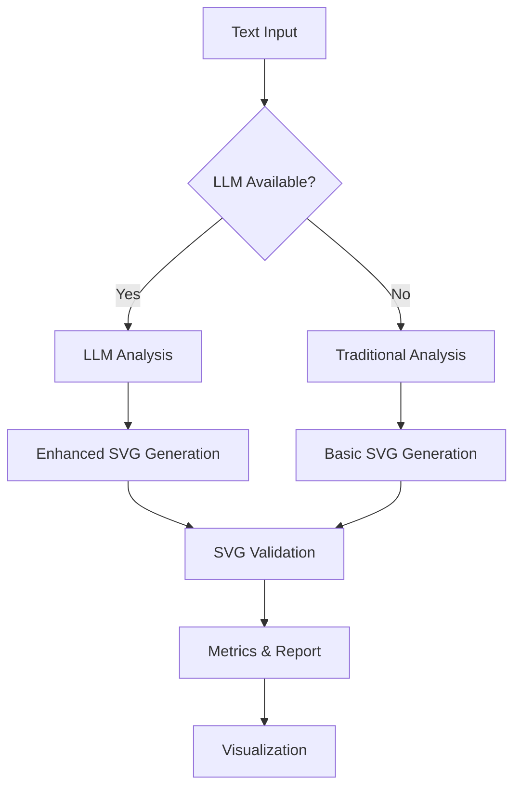

# GUI Simulator - Drawing with LLMs

<div align="center">


**Interactive graphical simulator for the "Drawing with LLMs" Kaggle competition project**

*A complete tool for generating SVG graphics from textual descriptions using language models*

</div>

---

## 🎯 Project Description

**GUI Simulator** is a standalone application with graphical interface developed as part of the **"Drawing with LLMs"** project for the Kaggle competition. This simulator allows experimenting with automatic SVG code generation from textual descriptions in natural language, using both traditional processing techniques and advanced language models (LLMs).

### 🏆 Competition Context

This project is part of the **"Drawing with LLMs"** Kaggle competition, where the goal is to develop systems capable of generating accurate and creative SVG graphical representations from textual descriptions. The GUI simulator provides an interactive platform to experiment with different approaches and evaluate model performance.

## ✨ Main Features

### 🖥️ Advanced Graphical Interface
- **Intuitive design**: Developed with tkinter for maximum compatibility
- **Organized panels**: Clear separation between input, results and metrics
- **Real-time**: Dynamic updates during processing
- **Responsive**: Interface adaptable to different resolutions

### 🤖 Multi-platform LLM Integration
- **OpenAI GPT**: Support for GPT-3.5 and GPT-4
- **HuggingFace**: Open source local models
- **Ollama**: Integration with optimized local models
- **Traditional fallback**: Rule-based SVG generator

### 📊 Complete Performance Analysis
- **GPU metrics**: Usage and memory monitoring of multiple GPUs
- **System metrics**: CPU, RAM, disk and network I/O
- **Response time**: Detailed tracking of LLM times
- **Success rates**: Generation quality analysis

### 🎨 Advanced SVG Generation
- **Natural scenes**: Landscapes, forests, oceans
- **Geometric elements**: Basic and complex shapes
- **Clothing and textiles**: Patterns and textures
- **Automatic validation**: Valid SVG code verification

## 🗂️ Project Structure

```
gui_simulator/
├── 📁 __pycache__/              # Python compiled files
├── 📄 __init__.py               # Package configuration
├── 📄 __main__.py               # Entry point as module
├── 🎮 main.py                   # Main application with GUI (998 lines)
├── 🎨 svg_generator.py          # SVG generator (665 lines)
├── 📊 data_processor.py         # Data processor and analyzer (365 lines)
├── ⚡ performance_analyzer.py   # Performance analyzer (707 lines)
├── 🤖 llm_connector.py          # LLM connectors (494 lines)
├── 🦙 ollama_connector.py       # Specific connector for Ollama
├── 🧪 test_llm_integration.py   # LLM integration tests (175 lines)
├── 🚀 run.py                    # Alternative execution script
├── 📋 requirements.txt          # Project dependencies
└── 📖 README.md                 # Main documentation
```

## ⚡ Quick Installation

### Prerequisites
- **Python 3.8+** (recommended Python 3.9 or higher)
- **Operating system**: Windows, macOS, Linux
- **RAM**: Minimum 4GB (8GB recommended for LLMs)
- **Disk space**: 1GB free

### Basic Installation

```bash
# 1. Clone the repository
git clone <repository-url>
cd finalDelivery_drawing-with-llms

# 2. Create virtual environment (recommended)
python -m venv venv

# Activate environment (Windows)
venv\Scripts\activate

# Activate environment (Linux/macOS)
source venv/bin/activate

# 3. Install basic dependencies
pip install -r gui_simulator/requirements.txt

# 4. Run automatic installer (optional)
python install.py
```

### LLM Installation

To enable language model capabilities:

```bash
# Option 1: OpenAI (requires API key)
pip install openai>=1.3.0
export OPENAI_API_KEY="your-api-key-here"

# Option 2: HuggingFace (local models)
pip install transformers>=4.20.0 torch>=2.0.0

# Option 3: Ollama (recommended for local use)
# Install Ollama from https://ollama.ai
ollama pull llama3.1:8b
```

## 🚀 Application Usage

### Execution

```bash
# Method 1: As Python module
python -m gui_simulator

# Method 2: Direct script
python gui_simulator/main.py

# Method 3: Execution script
python gui_simulator/run.py
```

### Programmatic Usage

```python
from gui_simulator.main import DrawingWithLLMsGUI
import tkinter as tk

# Create application
root = tk.Tk()
app = DrawingWithLLMsGUI(root)

# Configure window
root.title("My Drawing with LLMs Simulator")
root.geometry("1400x900")

# Execute
root.mainloop()
```

## 🔧 System Components

### 🎨 SVGGenerator (`svg_generator.py`)

SVG code generator based on text analysis and predefined patterns:

```python
from gui_simulator.svg_generator import SVGGenerator

generator = SVGGenerator()
svg_code = generator.generate_svg("a purple forest at dusk")
```

**Features:**
- ✅ 29+ supported colors
- ✅ Basic and complex geometric shapes
- ✅ Natural scenes (forests, oceans, skies)
- ✅ Clothing and textile elements
- ✅ Automatic SVG validation

### 📊 DataProcessor (`data_processor.py`)

Advanced processor for text analysis and feature extraction:

```python
from gui_simulator.data_processor import DataProcessor

processor = DataProcessor()
features = processor.extract_features("burgundy corduroy pants")
stats = processor.analyze_dataset(descriptions_list)
```

**Features:**
- ✅ Color and shape extraction
- ✅ Automatic categorization
- ✅ Statistical dataset analysis
- ✅ Complex pattern detection

### ⚡ PerformanceAnalyzer (`performance_analyzer.py`)

Real-time monitoring system with multi-GPU support:

```python
from gui_simulator.performance_analyzer import PerformanceAnalyzer

analyzer = PerformanceAnalyzer()
analyzer.start_session()
metrics = analyzer.get_real_time_metrics()
gpu_info = analyzer.get_all_gpu_usage()
```

**Monitored metrics:**
- 🖥️ **CPU**: Percentage usage and cores
- 💾 **RAM**: Current and available usage
- 🎮 **GPU**: Usage, memory, temperature (multi-GPU)
- 💿 **Disk**: I/O operations per second
- 🌐 **Network**: Inbound and outbound traffic
- ⏱️ **LLM**: Specific response times

### 🤖 LLMConnector (`llm_connector.py`)

Unified connector system for different LLM providers:

```python
from gui_simulator.llm_connector import LLMManager

manager = LLMManager()
available = manager.get_available_connectors()  # ['openai', 'ollama']
result = manager.generate_svg_enhanced("a starlit night")
```

**Supported connectors:**
- 🤖 **OpenAI**: GPT-3.5-turbo, GPT-4, GPT-4-turbo
- 🤗 **HuggingFace**: T5, FLAN-T5, and seq2seq models
- 🦙 **Ollama**: Llama 3.1, CodeLlama, Mistral

## 📱 User Interface

### Main Control Panel
- **🏃 Run Complete Simulation**: Executes complete dataset simulation
- **📊 Analyze Dataset**: Statistical analysis without generation
- **🗑️ Clear Results**: Clears results and metrics
- **📤 Export Results**: Exports results in JSON format
- **📁 Load Dataset**: Loads dataset from CSV/TXT file

### Data Input Panel
- **✏️ Individual description**: Field for quick tests
- **📝 Complete dataset**: Editor for multiple descriptions
- **🎯 Generate SVG**: Immediate individual generation

### Results Panel
- **🎨 SVG Code**: Visualization of generated code
- **👁️ Visualize SVG**: Preview in web browser
- **🔍 Processing analysis**: Detailed generation metrics

### Real-time Metrics Panel
- **📈 Processed cases**: Counter of processed elements
- **✅ Success rate**: Percentage of successful generations
- **⏱️ Average LLM time**: Specific LLM response time
- **🚀 Throughput**: Predictions per second
- **🖥️ CPU/GPU usage**: System resource monitoring

## 🧪 Testing and Validation

### LLM Testing Script

```bash
# Run integration tests
python gui_simulator/test_llm_integration.py
```

### Manual Tests

```python
# Check available connectors
from gui_simulator.llm_connector import LLMManager
manager = LLMManager()
print(manager.get_available_connectors())

# Quick generation test
from gui_simulator.svg_generator import SVGGenerator
generator = SVGGenerator()
svg = generator.generate_svg("a red circle")
print(len(svg))  # Should be > 0
```

## 📄 Data Formats

### Dataset Input

**CSV format:**
```csv
id,description
1,"a purple forest at dusk"
2,"gray wool coat with a faux fur collar"
```

**Numbered format:**
```
01. a purple forest at dusk
02. gray wool coat with a faux fur collar
03. a lighthouse overlooking the ocean
```

**Simple text format:**
```
a purple forest at dusk
gray wool coat with a faux fur collar
a lighthouse overlooking the ocean
```

### Results Output

**Export JSON:**
```json
{
  "timestamp": "2024-07-12T15:30:45",
  "total_cases": 15,
  "summary": {
    "success_rate": 95.5,
    "avg_time": 0.234,
    "avg_elements": 8.2
  },
  "results": [...]
}
```

## ⚙️ Advanced Configuration

### Environment Variables

```bash
# OpenAI
export OPENAI_API_KEY="sk-..."
export OPENAI_ORG_ID="org-..."  # Optional

# HuggingFace
export HF_TOKEN="hf_..."        # Optional for private models

# Ollama
export OLLAMA_HOST="localhost:11434"  # Customize host
```

### GPU Configuration

The system automatically detects available GPUs. For manual configuration:

```python
# In performance_analyzer.py
analyzer = PerformanceAnalyzer()
analyzer.primary_gpu_index = 1  # Use second GPU as primary
```

## 📊 Performance Metrics

### Typical Benchmarks

| Mode | Time/case | Throughput | SVG Quality |
|------|-----------|------------|-------------|
| Traditional generator | ~0.050s | 20 pred/s | Basic |
| OpenAI GPT-3.5 | ~0.800s | 1.25 pred/s | High |
| Ollama Llama3.1:8b | ~2.500s | 0.4 pred/s | Medium-High |
| HuggingFace T5 | ~1.200s | 0.83 pred/s | Medium |

### System Requirements by Mode

| Mode | Minimum RAM | Recommended GPU | CPU |
|------|------------|-----------------|-----|
| Traditional | 2GB | Not required | Dual-core |
| OpenAI | 4GB | Not required | Dual-core |
| Ollama | 8GB | 6GB VRAM | Quad-core |
| HuggingFace | 12GB | 8GB VRAM | Quad-core |

## 🔍 Troubleshooting

### Common Issues

**Error: "No module named 'gui_simulator'"**
```bash
# Make sure you're in the correct directory
cd finalDelivery_drawing-with-llms
python -m gui_simulator
```

**Error: "LLM Not Available"**
```bash
# Check installation
pip list | grep -E "openai|transformers|torch"

# Check Ollama
ollama list
```

**Low GPU performance**
```bash
# Check drivers
nvidia-smi

# Check PyTorch GPU
python -c "import torch; print(torch.cuda.is_available())"
```

### Debug Logs

```python
# Enable detailed logs
import logging
logging.basicConfig(level=logging.DEBUG)
```

## 👥 Development Team

This project was developed by students from **Universidad Distrital Francisco José de Caldas** as part of their academic work in artificial intelligence and natural language processing:

| Developer | Email | Role |
|-----------|-------|------|
| **Nelson David Posso Suarez** | ndpossos@udistrital.edu.co | System Architecture & LLM Integration |
| **Edward Julian Garcia Gaitan** | ejgarciag@udistrital.edu.co | GUI Development & Performance Analysis |
| **Jaider Camilo Carvajal Marin** | jccarvajalm@udistrital.edu.co | SVG Generation & Data Processing |

### 🎓 Academic Institution

**Universidad Distrital Francisco José de Caldas**
- Faculty of Engineering
- Systems Engineering Program
- Research line: Artificial Intelligence and Machine Learning

## 📋 Dependencies

### Main Dependencies

```txt
pandas>=2.0.0          # Data processing
numpy>=1.20.0          # Numerical operations
requests>=2.28.0       # HTTP communication
defusedxml>=0.7.0      # Secure XML/SVG validation
matplotlib>=3.5.0      # Optional visualizations
psutil>=5.9.0          # System monitoring
```

### Optional LLM Dependencies

```txt
openai>=1.3.0          # OpenAI GPT-3.5/4
transformers>=4.20.0   # HuggingFace models
torch>=2.0.0           # PyTorch for HF
requests>=2.28.0       # Ollama HTTP API
GPUtil>=1.4.0          # Advanced GPU monitoring
```

### Development Dependencies

```txt
pytest>=7.0.0          # Testing framework
black>=22.0.0          # Code formatter
flake8>=5.0.0          # Linting
mypy>=1.0.0            # Type checking
```

## 🏗️ Technical Architecture

### Design Pattern

The simulator implements a modular architecture based on the **Strategy** pattern for LLM connectors and **Observer** for real-time metrics:

```
┌─────────────────┐    ┌─────────────────┐    ┌─────────────────┐
│   GUI Main      │───▶│  LLM Manager    │───▶│  LLM Connectors │
│   (Controller)  │    │   (Strategy)    │    │   (Strategies)  │
└─────────────────┘    └─────────────────┘    └─────────────────┘
         │                        │
         ▼                        ▼
┌─────────────────┐    ┌─────────────────┐
│ Performance     │    │ SVG Generator   │
│ Analyzer        │    │ & Processor     │
│ (Observer)      │    │                 │
└─────────────────┘    └─────────────────┘
```

### Threading Model

- **Main Thread**: GUI and user events
- **Worker Thread**: Simulations and heavy processing
- **Metrics Thread**: System metrics collection
- **LLM Thread**: External API calls (non-blocking)

## 🔄 Processing Lifecycle



## 📊 Use Cases

### 1. Academic Research
- Comparison of generation techniques
- SVG quality analysis
- LLM model benchmarking

### 2. Model Development
- Rapid prototyping
- Hypothesis validation
- Prompt experimentation

### 3. Kaggle Competition
- Submission generation
- Dataset analysis
- Performance optimization

### 4. Education
- LLM concept demonstration
- NLP processing visualization
- Interactive learning

## 🔮 Future Improvements

### Planned Features

- [ ] **Support for more LLMs**: Claude, Gemini, Cohere
- [ ] **Integrated SVG editor**: Direct visual modification
- [ ] **Batch processing**: Optimized massive processing
- [ ] **Advanced metrics**: Semantic quality, diversity
- [ ] **REST API**: External programmatic access
- [ ] **Docker support**: Complete containerization

### Technical Optimizations

- [ ] **Intelligent caching**: LLM response cache
- [ ] **Parallelization**: Multi-core processing
- [ ] **Streaming**: Real-time LLM responses
- [ ] **Compression**: Generated SVG optimization

## 📜 License

```
MIT License

Copyright (c) 2024 Universidad Distrital Francisco José de Caldas
Drawing with LLMs Project Team

Permission is hereby granted, free of charge, to any person obtaining a copy
of this software and associated documentation files (the "Software"), to deal
in the Software without restriction, including without limitation the rights
to use, copy, modify, merge, publish, distribute, sublicense, and/or sell
copies of the Software, and to permit persons to whom the Software is
furnished to do so, subject to the following conditions:

The above copyright notice and this permission notice shall be included in all
copies or substantial portions of the Software.

THE SOFTWARE IS PROVIDED "AS IS", WITHOUT WARRANTY OF ANY KIND, EXPRESS OR
IMPLIED, INCLUDING BUT NOT LIMITED TO THE WARRANTIES OF MERCHANTABILITY,
FITNESS FOR A PARTICULAR PURPOSE AND NONINFRINGEMENT. IN NO EVENT SHALL THE
AUTHORS OR COPYRIGHT HOLDERS BE LIABLE FOR ANY CLAIM, DAMAGES OR OTHER
LIABILITY, WHETHER IN AN ACTION OF CONTRACT, TORT OR OTHERWISE, ARISING FROM,
OUT OF OR IN CONNECTION WITH THE SOFTWARE OR THE USE OR OTHER DEALINGS IN THE
SOFTWARE.
```

## 📞 Support and Contact

### For Technical Issues
- 🐛 **Bugs**: Use the repository issue system
- 💡 **Feature requests**: GitHub Discussions
- 📖 **Documentation**: Project Wiki

### Academic Contact
- 🏛️ **University**: Universidad Distrital Francisco José de Caldas
- 📧 **Project email**: drawing-with-llms@udistrital.edu.co
- 🌐 **Website**: [Universidad Distrital](https://www.udistrital.edu.co)

### Community
- 💬 **Discord**: Project channel (coming soon)
- 📺 **YouTube**: Tutorials and demonstrations
- 📰 **Blog**: Project updates

---

<div align="center">

**⭐ If you find this project useful, don't forget to give it a star on GitHub ⭐**

**Developed with ❤️ by the Drawing with LLMs team**  
**Universidad Distrital Francisco José de Caldas - 2024**

</div>
